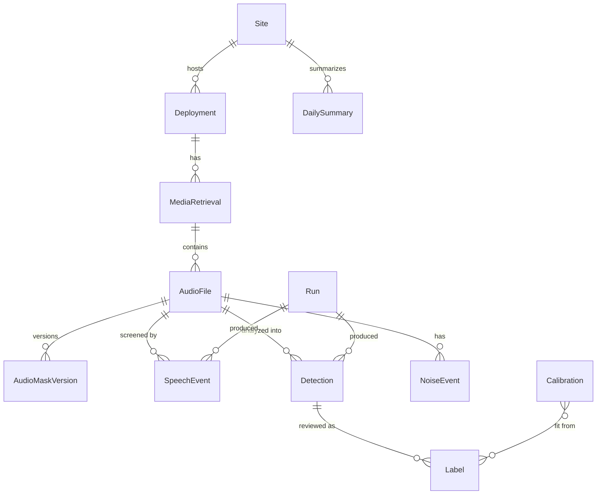

# Data Model

## Context and Design Philosophy

This LLD defines the field-level contract for every entity in HLD §4 as Pydantic v2 models
(package `urbanbio.models`) and the Parquet tables that persist them (HLD §4 "Formats"). Every
stage reads and writes these models; nothing passes untyped dicts between stages.

Principles:

- **Public-safe by default.** No persisted model has a field for exact coordinates, addresses,
  or people's names. Exact site coordinates come from private configuration (an environment
  variable; see [config-cli](../config-cli/config-cli-design.md) § Private values) and are reduced to generalized
  coordinates when configuration loads. Positions that recorders write into their own headers
  and logs are kept only verbatim in the private archive's sidecars and device logs
  ([archive](../archive/archive-design.md)), never parsed into a table.
- **Append-only records.** Rows are never updated in place. A change, such as a re-mask, adds a
  new versioned row, so earlier runs stay reproducible (HLD G1, Tenet 2).
- **Deterministic IDs.** IDs that identify content derive from content checksums, so ingesting
  the same card twice produces the same IDs (HLD §2 "Idempotency").
- **Units in names.** Numeric fields carry their unit as a suffix (`_s`, `_hz`, `_v`, `_c`,
  `_m`, `_deg`). All datetimes are timezone-aware UTC (`_utc` suffix) unless named `_local`.

## Identifiers

| Entity | ID field | Format | Derivation |
|---|---|---|---|
| Site | `site_id` | `site<N>` (regex `^site[0-9]+$`) | Assigned by the maintainer |
| Deployment | `deployment_id` | `<site_id>-dep<NNN>`, e.g. `site1-dep001` | Next sequence number per site |
| MediaRetrieval | `retrieval_id` | `<deployment_id>-r<NNN>`, e.g. `site1-dep001-r004` | Next sequence number per deployment |
| AudioFile | `audio_file_id` | `af-<16 hex>` | First 16 hex characters of the original file's SHA-256 |
| SpeechEvent | `speech_event_id` | `se-<16 hex>` | SHA-256 of `audio_file_id`, `run_id`, `detector`, `start_s` |
| Detection | `detection_id` | `det-<16 hex>` | SHA-256 of `model_id`, `audio_file_id`, `mask_version`, `start_s`, `label` |
| Label | `label_id` | `lbl-<16 hex>` | SHA-256 of `detection_id`, `reviewer_id`, `labeled_utc` |
| Calibration | `calibration_id` | `cal-<16 hex>` | SHA-256 of `taxon_key`, `model_id`, `label_set_hash` |
| Run | `run_id` | `<stage>-<YYYYMMDDTHHMMSSZ>-<4 hex>` | Stage, start time, random suffix |

A `detection_id` is stable across runs: re-running the same model on the same masked audio
produces the same IDs, so reviewers' labels and published `occurrenceID`s keep pointing at the
same detection. Two runs of one model with different parameters can produce rows with the same
`detection_id`; their `run_id` tells them apart, and confidence may differ.

All IDs match `^[a-z0-9-]+$`. Sixteen hex characters (64 bits) keep the collision probability
negligible at the project's scale (about 10⁶ audio files per decade).

`reviewer_id` is an opaque handle such as `reviewer1`, never a name.

## Entities

Types are Python/Pydantic types. "Null" means the field is `T | None`. Every model sets
`model_config = ConfigDict(frozen=True, extra="forbid")`.

### Site

| Field | Type | Null | Unit / notes |
|---|---|---|---|
| `site_id` | `str` | no | Opaque ID |
| `latitude_generalized_deg` | `float` | no | WGS84, rounded to the published precision |
| `longitude_generalized_deg` | `float` | no | WGS84, rounded to the published precision |
| `coordinate_uncertainty_m` | `int` | no | Declared uncertainty after generalization (DwC `coordinateUncertaintyInMeters`) |
| `generalization` | `str` | no | Human-readable rule, e.g. "rounded to 0.01°" (DwC `dataGeneralizations`) |
| `habitat` | `str` | yes | Free text, no location names |
| `nws_station_id` | `str` | yes | Nearest NWS observation station, for the curate stage |

A Site is a fixed location. A recorder moved more than 500 m (the intake position-check
distance) goes to a new `site_id`, so comparisons between sites never mix two places. Smaller
moves stay on the same site and are noted in the new deployment's `comments`.

### Deployment

Aligned with the Camtrap DP 1.0.2 `deployments` table so the image branch reuses it (HLD §7).

| Field | Type | Null | Unit / notes | Camtrap DP field |
|---|---|---|---|---|
| `deployment_id` | `str` | no | | `deploymentID` |
| `site_id` | `str` | no | FK → Site | `locationID` |
| `start_utc` | `datetime` | no | Recorder start | `deploymentStart` |
| `end_utc` | `datetime` | yes | Null while active | `deploymentEnd` |
| `device_make` | `str` | no | e.g. `Wildlife Acoustics` | `cameraModel` (as `make-model`) |
| `device_model` | `str` | no | e.g. `Song Meter Micro 2` | `cameraModel` |
| `device_serial` | `str` | no | | `cameraID` |
| `recorder_name` | `str` | no | Name configured on the device; must be opaque (see [songmeter-micro2](../ingest/songmeter-micro2/songmeter-micro2-design.md)) | — |
| `firmware_version` | `str` | yes | Filled from the first ingested file | — |
| `adapter` | `str` | no | Recorder adapter key, e.g. `songmeter-micro2` | — |
| `sample_rate_hz` | `int` | no | Configured rate | — |
| `schedule` | `RecordingSchedule` | no | See below | `captureMethod` analogue |
| `gain_db` | `float` | yes | | — |
| `mount_height_m` | `float` | yes | | `cameraHeight` |
| `mount_heading_deg` | `int` | yes | 0–360 | `cameraHeading` |
| `timestamp_issues` | `bool` | no | Default false; set when clock problems are known | `timestampIssues` |
| `tags` | `list[str]` | no | Default empty | `deploymentTags` |
| `comments` | `str` | yes | No names or location details | `deploymentComments` |

A Deployment's recording configuration is fixed for its lifetime. Changing any of device,
`sample_rate_hz`, `schedule`, `gain_db`, or mounting ends the deployment and starts a new one,
matching Camtrap DP's meaning of a deployment. `urbanbio deployment create` refuses to overlap
an active deployment on the same device.

`RecordingSchedule`: `duty_on_s: int`, `duty_off_s: int` (0 for continuous),
`max_file_length_s: int`, `daily_windows: list[tuple[time, time]] | None` (local recorder time;
null means around the clock), `utc_offset_minutes: int` (the fixed offset configured on the
device).

Deployment rows are append-only versions. Filling in `firmware_version`, setting
`timestamp_issues`, or setting `end_utc` writes a new row, and the `current_deployments` view
takes the latest row per `deployment_id`.

Camtrap DP `setupBy` has no counterpart because it holds people's names. Camtrap DP
`latitude`/`longitude` come from the Site's generalized coordinates when exported.

### MediaRetrieval

Camtrap DP has no retrieval concept. MediaRetrieval is the shared parent of media for both the
audio and image branches, and its files map row-for-row onto the Camtrap DP `media` table (see
AudioFile).

| Field | Type | Null | Unit / notes |
|---|---|---|---|
| `retrieval_id` | `str` | no | |
| `deployment_id` | `str` | no | FK → Deployment |
| `retrieved_utc` | `datetime` | no | When the card was pulled (entered at ingest) |
| `first_file_start_utc` | `datetime` | yes | Earliest file in the retrieval |
| `last_file_end_utc` | `datetime` | yes | Latest file end |
| `expected_file_count` | `int` | yes | From the device log, when the adapter provides one |
| `file_count` | `int` | no | Audio files ingested |
| `total_bytes` | `int` | no | Original bytes ingested |
| `manifest_sha256` | `str` | no | SHA-256 of the retrieval manifest (sorted paths, sizes, checksums) |
| `battery_start_v` | `float` | yes | First logged voltage |
| `battery_end_v` | `float` | yes | Last logged voltage |
| `battery_min_v` | `float` | yes | |
| `clock_offset_s` | `float` | yes | Device clock minus reference clock at retrieval; positive means the device was fast |
| `reboot_count` | `int` | no | Device restarts seen in the log |
| `anomalies` | `list[Anomaly]` | no | See below |
| `ingest_run_id` | `str` | no | FK → Run |

A retrieval copied and ingested in parts produces one MediaRetrieval row per ingest run. The
`current_retrievals` view combines them per `retrieval_id`: counts and bytes are recomputed
from `audio_files`, time spans and battery values take the minimum or maximum across rows, and
anomalies are concatenated.

`Anomaly`: `code: str` (e.g. `gap`, `reboot`, `file_count_mismatch`, `timestamp_mismatch`,
`low_battery`, `clock_drift`, `offset_change`, `position_mismatch`, `unknown_file`,
`high_masked_fraction`), `start_utc: datetime | None`, `end_utc: datetime | None`,
`detail: str`.

### AudioFile

One recording. Static facts about the original file. Camtrap DP `media` alignment:
`audio_file_id` → `mediaID`, `deployment_id` → `deploymentID`, `start_utc` → `timestamp`,
`archive_key` → `filePath`, `filePublic = false`, `fileMediatype = audio/flac`.

| Field | Type | Null | Unit / notes |
|---|---|---|---|
| `audio_file_id` | `str` | no | |
| `retrieval_id` | `str` | no | FK → MediaRetrieval |
| `deployment_id` | `str` | no | Denormalized for partitioning |
| `site_id` | `str` | no | Denormalized for partitioning |
| `original_filename` | `str` | no | As on the card |
| `original_sha256` | `str` | no | 64 hex, bytes of the original file |
| `original_pcm_sha256` | `str` | no | 64 hex, the decoded sample data only |
| `original_bytes` | `int` | no | |
| `start_utc` | `datetime` | no | After time-zone normalization and clock correction |
| `start_local` | `datetime` | no | Naive device-local start as recorded |
| `utc_offset_minutes` | `int` | no | Offset used for normalization |
| `clock_correction_s` | `float` | no | Correction applied; 0 when none |
| `duration_s` | `float` | no | frames / sample rate |
| `sample_rate_hz` | `int` | no | |
| `channels` | `int` | no | |
| `bit_depth` | `int` | no | |
| `frames` | `int` | no | |
| `device_temperature_c` | `float` | yes | From header metadata when present |
| `archive_key` | `str` | no | AWS S3 key of the archived FLAC |
| `sidecar_key` | `str` | no | AWS S3 key of the header sidecar |

The HLD's storage tier is derived too: the `audio_file_tier` view reports `STANDARD` until
`glacier_transition_days` after the current mask version's `created_utc`, then `GLACIER_IR`
(files under 128 KB, such as fully masked minutes, stay `STANDARD`). Lifecycle transitions run
asynchronously in AWS S3, so the view gives the billed class, which starts on the rule's date.

A file's processing status is derived from the stage-unit ledger
([runs](../runs/runs-design.md)) rather than stored on the record. The `audio_file_status` view
reports the furthest stage completed: `quarantined` → `screened` → `archived` → `purged`, or
`flagged` (stopped with a recorded reason; never purged automatically).

### AudioMaskVersion

One masked version of an AudioFile. A re-mask adds a row with the next `mask_version`; the
archive holds only the latest version (see [archive](../archive/archive-design.md)).

| Field | Type | Null | Unit / notes |
|---|---|---|---|
| `audio_file_id` | `str` | no | FK → AudioFile |
| `mask_version` | `int` | no | 1 for the first archive |
| `masked_sha256` | `str` | no | Bytes of the archived FLAC |
| `masked_pcm_sha256` | `str` | no | Decoded masked samples |
| `speech_event_ids` | `list[str]` | no | Events whose intervals this version zeroes |
| `masked_seconds` | `float` | no | Total zeroed duration |
| `run_id` | `str` | no | FK → Run |
| `created_utc` | `datetime` | no | |
| `storage_class` | `str` | no | Storage class at write time, e.g. `STANDARD` |

### SpeechEvent

One speech detector hit. No audio content.

| Field | Type | Null | Unit / notes |
|---|---|---|---|
| `speech_event_id` | `str` | no | |
| `audio_file_id` | `str` | no | FK → AudioFile |
| `detector` | `Literal["birdnet-human", "silero-vad", "manual"]` | no | `manual` for speech found during recall labeling |
| `detector_label` | `str` | yes | e.g. `Human vocal` for BirdNET |
| `score` | `float` | no | 0–1 |
| `start_s` | `float` | no | Offset from file start, before padding |
| `end_s` | `float` | no | |
| `masked_start_s` | `float` | no | After padding and clipping to the file |
| `masked_end_s` | `float` | no | |
| `run_id` | `str` | no | FK → Run |

### Detection

| Field | Type | Null | Unit / notes |
|---|---|---|---|
| `detection_id` | `str` | no | |
| `run_id` | `str` | no | FK → Run |
| `audio_file_id` | `str` | no | FK → AudioFile |
| `site_id` | `str` | no | Denormalized |
| `deployment_id` | `str` | no | Denormalized |
| `start_s` | `float` | no | Offset from file start |
| `end_s` | `float` | no | |
| `start_utc` | `datetime` | no | File `start_utc` + `start_s` |
| `label` | `str` | no | Raw model label, e.g. `Turdus migratorius_American Robin` |
| `scientific_name` | `str` | no | Parsed from `label` |
| `common_name` | `str` | no | Parsed from `label` (English, US) |
| `is_target_taxon` | `bool` | no | False for the model's non-taxon classes (human, engine, dog, noise, …) |
| `confidence` | `float` | no | 0–1, model output after sigmoid |
| `in_geo_list` | `bool` | no | Taxon passes the location/date filter for this site and week |
| `overlaps_mask` | `bool` | no | Window intersects a masked interval |
| `model_id` | `str` | no | e.g. `birdnet-acoustic-2.4-fp32` |
| `mask_version` | `int` | no | Mask version of the audio analyzed |

### Label, Calibration, WeatherObs, NoiseEvent, DailySummary

These are defined at interface level for Phase 1; their stages are specified in
[validate](../validate/validate-design.md) and [curate](../curate/curate-design.md).

- **Label:** `label_id`, `detection_id`, `reviewer_id`, `verdict: Literal["correct",
  "incorrect", "unsure"]`, `true_scientific_name: str | None`, `labeled_utc`, `tool: str`,
  `notes: str | None`.
- **Calibration:** `calibration_id`, `taxon_key` (scientific name), `model_id`, `method:
  Literal["logistic"]`, `intercept`, `slope` (on logit confidence), `label_count`,
  `positive_count`, `target_precision`, `threshold_at_target: float | None`, `label_set_hash`,
  `run_id`, `created_utc`.
- **WeatherObs:** `station_id`, `observed_utc`, `temperature_c`, `wind_speed_m_s`,
  `precipitation_mm`, `relative_humidity_pct` (all nullable except IDs and time).
- **NoiseEvent:** `noise_event_id`, `audio_file_id`, `start_s`, `end_s`, `source: Literal["model",
  "manual"]`, `noise_class: str`, `score: float | None`, `run_id`.
- **DailySummary:** `site_id`, `date_local`, `taxon_key`, `calibration_id: str | None`,
  `validation_status: Literal["calibrated", "unvalidated"]`, `detection_count`,
  `active_minutes`, `recorded_minutes`, `first_detection_utc`, `last_detection_utc`, `run_id`.

### Run

Defined in [runs](../runs/runs-design.md).

## Relationships



## Parquet Tables

Each table is written with `pyarrow` (zstd compression) from an explicit Arrow schema declared
next to its Pydantic model. A test asserts that the two declarations agree. Each file carries
`urbanbio.schema_version` in its key-value metadata. Additive changes (a new nullable column)
increment the minor version; any other change is a new major version and a new table path.

Files are immutable and written once per (run, unit) so writes are idempotent: rewriting the
same unit produces the same file name.

| Table | Key prefix in AWS S3 | Partitioning (Hive style) | One file per |
|---|---|---|---|
| `sites` | `curated/sites/` | none | config load (overwritten; derived from config) |
| `deployments` | `curated/deployments/` | none | deployment change (`<deployment_id>-<run_id>.parquet`) |
| `media_retrievals` | `curated/media_retrievals/` | `site_id=` | ingest run |
| `audio_files` | `curated/audio_files/` | `site_id=`, `year_month=` | ingest run × retrieval |
| `audio_mask_versions` | `curated/audio_mask_versions/` | `site_id=`, `year_month=` | archive run × retrieval |
| `speech_events` | `curated/speech_events/` | `site_id=`, `year_month=` | screen run × retrieval |
| `screen_file_stats` | `curated/screen_file_stats/` | `site_id=`, `year_month=` | screen run × retrieval (fields in [speech-screen](../speech-screen/speech-screen-design.md)) |
| `speech_labels` | `curated/speech_labels/` | none | label import (`audio_file_id`, `start_s: float \| None`, `end_s: float \| None`, `reviewer_id`, `labeled_utc`; null bounds mean "no speech"; no audio) |
| `waivers` | `curated/waivers/` | none | `runs unflag` (see [runs](../runs/runs-design.md) § Waivers) |
| `detections` | `curated/detections/` | `model_id=`, `site_id=`, `year_month=` | detect run × retrieval |
| `geo_species_lists` | `curated/geo_species_lists/` | `model_id=` | detect run |
| `runs` | `curated/runs/` | `stage=` | run |
| `stage_units` | `curated/stage_units/` | `stage=` | run (see [runs](../runs/runs-design.md)) |

`year_month` is the UTC `YYYY-MM` of the file start. Interface-level tables (`labels`,
`calibrations`, `weather_obs`, `noise_events`, `daily_summary`) follow the same pattern and are
specified with their stages.

Latest-version reads are views in DuckDB rather than stored state: `current_masks`,
`current_deployments`, `current_retrievals`, `audio_file_status`, and `audio_file_tier`. For
example:

```sql
CREATE VIEW current_masks AS
SELECT * FROM read_parquet('s3://<bucket>/curated/audio_mask_versions/**/*.parquet',
                           hive_partitioning = true)
QUALIFY row_number() OVER (PARTITION BY audio_file_id ORDER BY mask_version DESC) = 1;
```

## Querying with DuckDB

`urbanbio.storage.tables.connect()` returns a DuckDB connection with the `httpfs` extension
loaded and an AWS S3 secret created from the environment credential chain (`CREATE SECRET
(TYPE s3, PROVIDER credential_chain, REGION 'us-east-1')`). It registers one view per table over
`read_parquet('s3://<bucket>/curated/<table>/**/*.parquet', hive_partitioning = true,
union_by_name = true)`, so partition columns are queryable and filters on them prune files.

Curated tables are small (detections are on the order of 10⁶–10⁷ rows a year, tens to hundreds
of MB), so reading them from AWS S3 into either environment stays within the monthly free
egress allowance (see [archive](../archive/archive-design.md) § Cost).

## Decisions & Alternatives

| Decision | Chosen | Alternatives Considered | Rationale |
|---|---|---|---|
| Audio file identity | Prefix of the original SHA-256 | UUID; recorder filename | Re-ingesting a card yields the same ID, which makes ingest idempotent. Filenames can collide across recorders and contain the recorder name. |
| Mutability | Append-only rows; re-masks add `AudioMaskVersion` rows | Update AudioFile in place | Earlier detection runs record the mask version they analyzed, so G1 reproducibility holds after a re-mask. |
| Exact coordinates | Not representable in any persisted model | Store in a "private" column and filter on publish | A field that doesn't exist can't leak through a forgotten publish filter (G3). |
| Camtrap DP alignment | Mirror deployment fields and media mapping; keep MediaRetrieval as a project entity | Store Camtrap DP tables directly | The audio branch needs fields Camtrap DP lacks (sample rate, schedule). A field mapping lets the image branch export Camtrap DP without the audio branch depending on its schema. |
| Table layout | Hive-partitioned Parquet, one immutable file per run × unit | A single growing file per table; a DuckDB database file in AWS S3 | Immutable files make writes idempotent and safe to retry, and DuckDB and DuckDB-WASM read them directly. |
| Detection table key | Partition by `model_id` first | Partition by run | Most queries compare or select a model. Runs within a model are filtered by `run_id`. |

## Open Questions & Future Decisions

### Deferred
1. Whether `common_name` should follow a single taxonomy (eBird/Clements) for joins with eBird
   data, or keep the model's label text. Decide in the curate stage.
2. GeoParquet for `sites` once a published map needs geometry.

## References

- HLD §4 (data model), §5.3 (layout), §6.2 (location privacy)
- Camtrap DP 1.0.2, data tables: https://camtrap-dp.tdwg.org/data/ (release 1.0.2, 2025-06-10)
- Darwin Core terms: https://dwc.tdwg.org/terms/
- DuckDB Parquet and S3 support: https://duckdb.org/docs/data/parquet/overview,
  https://duckdb.org/docs/extensions/httpfs/s3api
